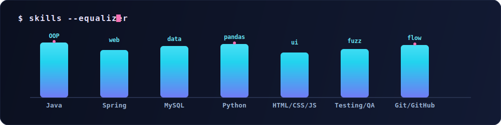

<!-- ════════════════════ HERO ════════════════════ -->
<p align="center">
  
</p>

<p align="center">
  <a href="https://github.com/ThanhhDuongg">
    
  </a>
</p>

<p align="center">
  
  
  
</p>

<br/>

<!-- ════════════════════ ABOUT ════════════════════ -->
## 🧑‍💻 About Me

```java
public class ThanhDuong extends Developer {
    String   university = "Phenikaa University";
    String   major      = "Software Engineering";
    String[] building   = { "Dorm Management System (Java)", "Pandas data notebooks" };
    String[] learning   = { "Spring Boot", "Software Testing & QA", "System Design" };
    String   motto      = "Code it. Test it. Ship it. Improve it.";
}
```

- 🎓 Sinh viên **Kỹ thuật phần mềm** tại **Đại học Phenikaa**, Hà Nội
- ☕ Yêu thích **Java & OOP** — xây dựng hệ thống quản lý ký túc xá từ phân tích thiết kế đến triển khai
- 🧪 Đang đào sâu **Software Testing**: fuzzing, symbolic execution, regression testing, test oracles
- 📊 Khám phá dữ liệu với **Python / Pandas / Jupyter** — phân tích sạch, kết quả tái lập được
- 🌱 Tin rằng code tốt là code mà *người tiếp theo* đọc vào hiểu ngay

<br/>

<!-- ════════════════════ PIPELINE ════════════════════ -->
<p align="center">
  
</p>

<br/>

<!-- ════════════════════ TECH STACK ════════════════════ -->
## 🛠️ Tech Stack

<p align="center">
  
</p>

<p align="center">
  
</p>

<br/>

<!-- ════════════════════ FEATURED PROJECTS ════════════════════ -->
## 🚀 Featured Projects

<table align="center">
  <tr>
    <td align="center" width="50%">
      <a href="https://github.com/ThanhhDuongg/OOP.KTX">
        
      </a>
      <br/><sub>🏠 Hệ thống quản lý ký túc xá — Java OOP</sub>
    </td>
    <td align="center" width="50%">
      <a href="https://github.com/ThanhhDuongg/PTPM_QuanlyKTX">
        
      </a>
      <br/><sub>🧩 Phát triển phần mềm quản lý KTX — Web</sub>
    </td>
  </tr>
  <tr>
    <td align="center" width="50%">
      <a href="https://github.com/ThanhhDuongg/SAD_N02_Term1_2025_K17_Group3">
        
      </a>
      <br/><sub>📐 Phân tích & Thiết kế hệ thống — Dự án nhóm</sub>
    </td>
    <td align="center" width="50%">
      <a href="https://github.com/ThanhhDuongg/Pandas_Excersie">
        
      </a>
      <br/><sub>🐼 Bài tập phân tích dữ liệu — Pandas / Jupyter</sub>
    </td>
  </tr>
</table>

<br/>

<!-- ════════════════════ GITHUB STATS ════════════════════ -->
## 📈 GitHub Analytics

<p align="center">
  
  
</p>

<p align="center">
  
</p>

<p align="center">
  
</p>

<!-- ════════════════════ SNAKE ════════════════════ -->
<p align="center">
  <picture>
    <source media="(prefers-color-scheme: dark)" srcset="https://raw.githubusercontent.com/ThanhhDuongg/ThanhhDuongg/output/github-contribution-grid-snake-dark.svg"/>
    <source media="(prefers-color-scheme: light)" srcset="https://raw.githubusercontent.com/ThanhhDuongg/ThanhhDuongg/output/github-contribution-grid-snake.svg"/>
    
  </picture>
</p>

<br/>

<!-- ════════════════════ CONNECT ════════════════════ -->
## 🤝 Connect With Me

<p align="center">
  <a href="https://github.com/ThanhhDuongg">
    
  </a>
  <a href="mailto:your-email@st.phenikaa-uni.edu.vn">
    
  </a>
  <a href="https://www.facebook.com/your-profile">
    
  </a>
</p>

<p align="center">
  <i>"Strong work is not only about writing code — it's about making the next step easier for whoever reads it."</i>
</p>

<!-- ════════════════════ FOOTER ════════════════════ -->

